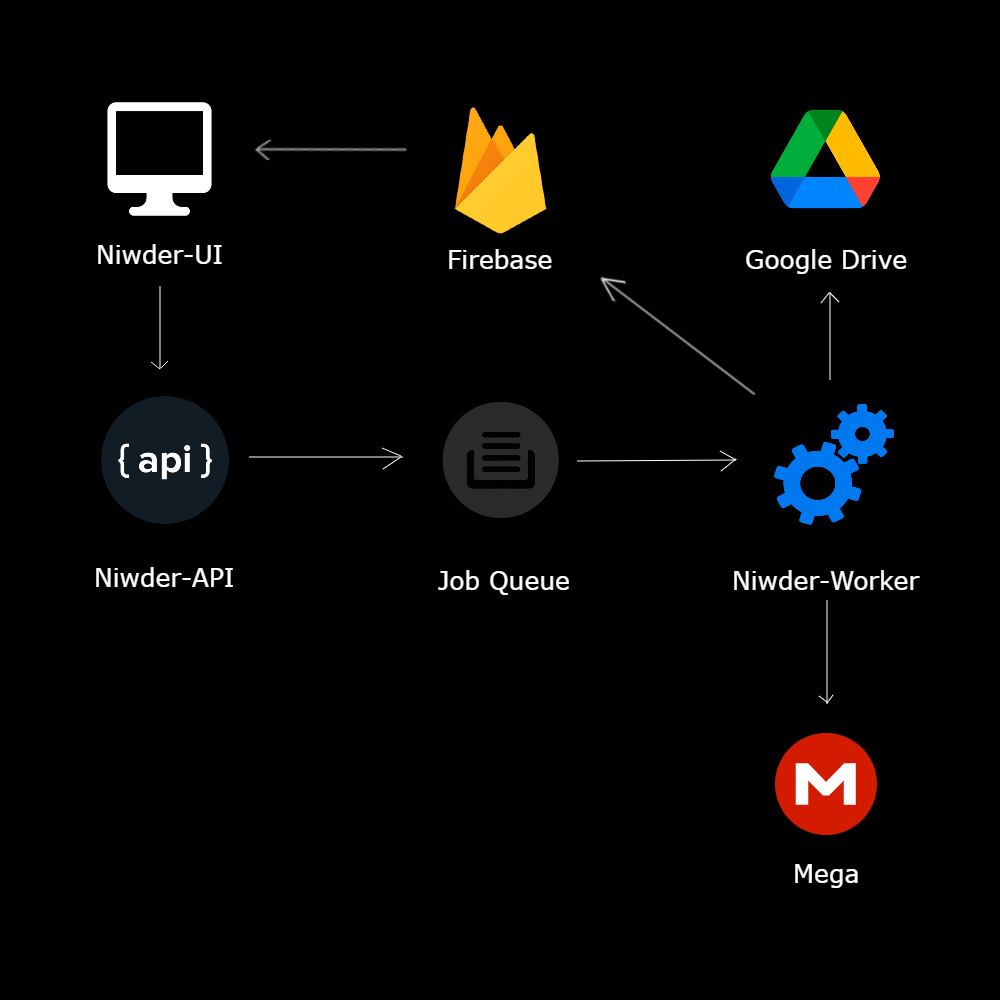
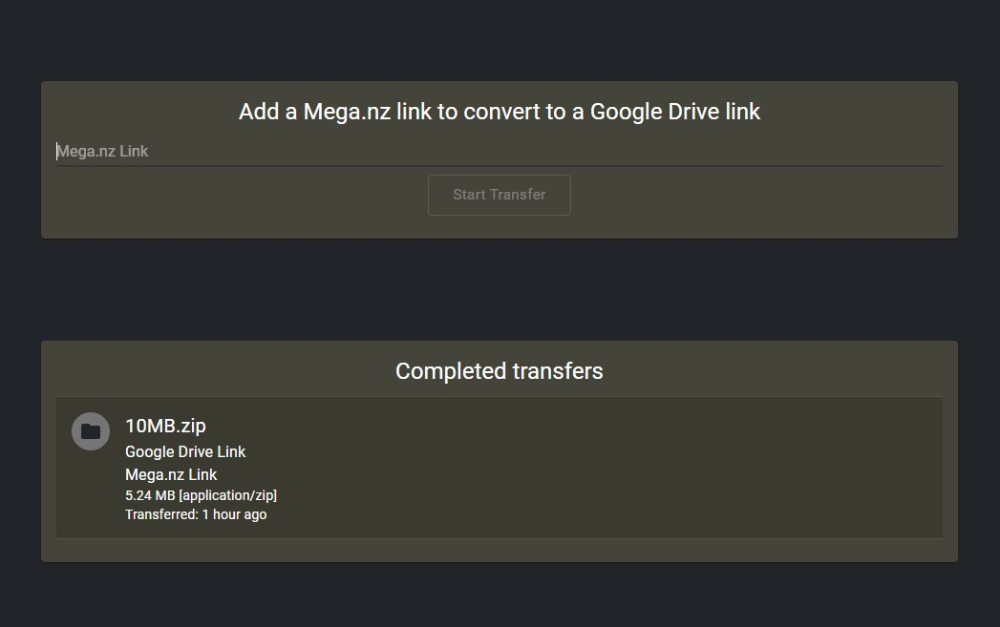
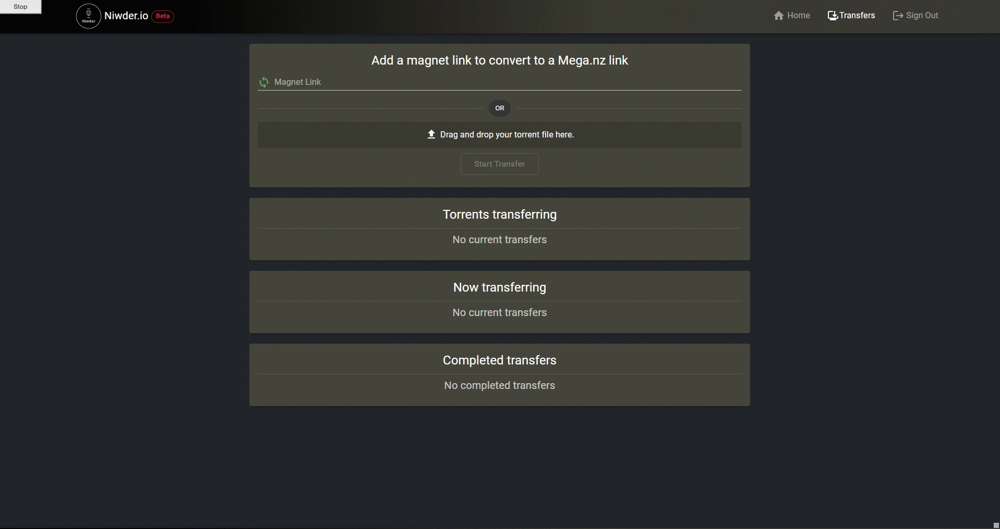

[](https://github.com/Niweera/niwder-api/actions)

```
 __    __  __                      __                      __           
|  \  |  \|  \                    |  \                    |  \          
| $$\ | $$ \$$ __   __   __   ____| $$  ______    ______   \$$  ______  
| $$$\| $$|  \|  \ |  \ |  \ /      $$ /      \  /      \ |  \ /      \
| $$$$\ $$| $$| $$ | $$ | $$|  $$$$$$$|  $$$$$$\|  $$$$$$\| $$|  $$$$$$\
| $$\$$ $$| $$| $$ | $$ | $$| $$  | $$| $$    $$| $$   \$$| $$| $$  | $$
| $$ \$$$$| $$| $$_/ $$_/ $$| $$__| $$| $$$$$$$$| $$ __   | $$| $$__/ $$
| $$  \$$$| $$ \$$   $$   $$ \$$    $$ \$$     \| $$|  \  | $$ \$$    $$
\$$   \$$ \$$  \$$$$$\$$$$   \$$$$$$$  \$$$$$$$ \$$ \$$   \$$  \$$$$$$
```


# Niwder-API

Niwder (a combo of words, [NIWeera](https://github.com/Niweera), DownloadER) is a long time dream of mine (actually I
got this idea around 2017, thanks to [nisalb](https://github.com/nisalb)), and I tried to realize this dream for years
but to no avail until now.

Niwder is a system in three parts where,

1. [Niwder-API](https://github.com/Niweera/niwder-api)
2. [Niwder-Worker](https://github.com/Niweera/niwder-api/tree/main/src/worker)
3. [Niwder-UI](https://github.com/Niweera/niwder)



Currently, a user can add a [Mega.nz](https://mega.nz) file link, and get it converted to
a [Google Drive](https://drive.google.com) file link. Since handling a public faced Google Drive app authentication is a
big hassle (you need to get the Drive app verified), I have used a dummy Google Drive account for storing the
transferred Mega.nz file. In a future release, I will try to add a feature so that anyone can get their files straight
into their Google Drive.

When a user add a Mega.nz file, the [Niwder-API](https://github.com/Niweera/niwder-api) will queue the transfer job
using [Niwder-Worker](https://github.com/Niweera/niwder-api/tree/main/src/worker) and the Niwder-Worker will handle the
transfer job and transfer the Mega.nz file to a pre-determined Google Drive.
The [Google Drive SDK](https://developers.google.com/drive) will provide the pre-shared download link for the
transferred file, and it will be visible in the [Niwder-UI](https://github.com/Niweera/niwder).

Niwder-UI and Niwder-API use [Firebase](https://firebase.google.com/) for hosting and authentication.



**This project uses [WebTorrent](https://github.com/webtorrent/webtorrent) for torrents transferring.**



🔥 This project uses source code
from [checker.openwebtorrent.com](https://github.com/OpenWebTorrent/checker.openwebtorrent.com)
by [OpenWebTorrent](https://github.com/OpenWebTorrent).

🎯 This project uses [Bull-Board](https://github.com/felixmosh/bull-board) by [felixmosh](https://github.com/felixmosh)
to visualize queues and jobs currently running in Niwder.io system. Since there is no personal data collected, the
Bull-Board job data is perfectly anonymized.

🍭 This project uses [LogDNA](https://www.logdna.com/) and [Winston](https://github.com/winstonjs/winston) for logging
purposes.

### Setting up Niwder-API

1. Install Mega-CMD (this will be automatically done by `Ansible` script).
2. [Log in to Mega-CMD](https://github.com/meganz/MEGAcmd/issues/36) using your email and password.
3. Add [Firebase Service Account JSON file](https://firebase.google.com/docs/admin/setup#initialize-sdk) to `/src/keys/`
   directory.
4. Create Google oAuth client ([learn how](https://support.google.com/cloud/answer/6158849?hl=en)).
5. Get a LogDNA Ingestion key ([learn how](https://docs.logdna.com/docs/ingestion-key)).
6. Add the following Environment Variables.

```bash
PORT=<number>
FIREBASE_API_KEY=<string>
REDIS_URL=<string>
GOOGLE_DRIVE_CLIENT_ID=<string>
GOOGLE_DRIVE_CLIENT_SECRET=<string>
BULL_UI_USERNAME=<string>
BULL_UI_PASSWORD=<string>
LOGDNA_INGESTION_KEY=<string>
```

#### Niwder API Specification (OpenAPI v3) is online and can be viewed from [here](https://niwder-api.niweera.gq/api/docs).

New features to keep an eye on;

- [x] Google Drive link to Mega.nz link
- [x] Direct download link to Google Drive link
- [x] Direct download link to Mega.nz link
- [x] Google Drive link to direct download link
- [x] Mega.nz to direct download link
- [x] Torrents to Google Drive link
- [x] Torrents to Mega.nz link
- [x] Torrents to direct download link

Niwder-API is live on https://niwder-api.niweera.gq. <br/>
Niwder is live on https://niwder.niweera.gq.
